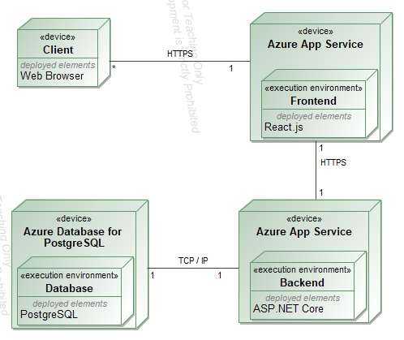

# 1. Sprendžiamo uždavinio aprašymas

## 1.1. Sistemos paskirtis

Projekto tikslas - sukurti kino teatro informacinę sistemą.

Kuriamą platformą sudaro klientinė dalis, serverinė dalis ir duomenų bazė. Klientas naudos klientinę sistemos dalį per grafinę naudotojo sąsają, kuri su serverine dalimi komunikuos per REST principu sudarytą API. Duomenys kaupiami duomenų bazėje.

Sistemoje egzistuos trys kliento rolės:

- Svečias
- Narys
- Administratorius

Sistema turi tarpusavyje susietus hierarchiniu ryšiu objektus (filmas -\> seansas -\> bilietas), kuriems bus realizuojami API metodai (CRUD + gauti objektų sąrašą), tarp jų ir hierarchiniai (pvz. API metodas gauti tam tikro filmo seansus).

Sistemoje bus realizuota autentifikacija ir autorizacija su OAuth2/JWT.

Sistema bus pasiekiama saityne, tam panaudojant debesų technologijas.

## 1.2. Funkciniai reikalavimai

**Svečias** galės:
- Peržiūrėti informaciją apie filmus ir jų seansus.
- Peržiūrėti tam tikro seanso bilietų informaciją.
- Užsiregistruoti

**Naudotojas** galės:
- Prisijungti / atsijungti
- Valdyti savo paskyrą
- Peržiūrėti informaciją apie filmus ir jų seansus.
- Peržiūrėti tam tikro seanso bilietų informaciją.
- Nusipirkti bilietą
- Peržiūrėti savo bilietus, juos redaguoti (pvz: keisti seanso laiką, bilieto tipą) ar naikinti (jei įmanoma)
- Parsisiųsti bilietą PDF formatu
- Reitinguoti matytus filmus

**Administratorius** galės:

- Tą patį kaip ir naudotojas
- Sukurti naujus filmus sistemoje, juos redaguoti ir ištrinti
- Sukurti tam tikro filmo seansus, juos redaugoti ir ištrinti
- Nustatyti vietų informaciją tam tikram seansui
- Valdyti nupirktus bilietus

# 2. Pasirinktų technologijų aprašymas

Klientinė dalis bus realizuojama su React.js karkasu. Tai yra modernus ir efektyvus karkasus kurti naudotojo sąsajoms, kuris leidžia sąsają skirstyti į komponentus ir juos lengvai pernaudoti. Naudotojo sąsajai pagrąžinti bus naudojama Bootstrap biblioteka.

Serverinė dalis bus realizuojama su ASP.NET Core karkasu, kuris yra lengvai konfigūruojamas ir puikiai tinka kurti RESTful API.

Pasirinkta duomenų bazė yra PostgreSQL dėl jos Entity Framework palaikymo serverinėje dalyje ir patogumo naudotis.

Autentifikacijai / autorizacijai užtikrinti bus naudojama OAuth2/JWT technologijos.

Sistema bus iškelta į Microsoft Azure debesį. Microsoft Azure buvo pasirinkta dėl esamos patirties dirbant su ja.

# 3. Sistemos architektūra

Žemiau pavaizduota kuriamos sistemos architektūra (pav. 1)



_pav. 1 Sistemos architektūra_

# 4. API specifikacija

## 4.1. Movie

### POST /api/v1/movies

#### Aprašymas:

Sukuria Movie objektą

#### Resurso URL:

**https://localhost:7252/api/v1/movies**

#### Resurso informacija:

- Atsakymo formatas: JSON
- Reikalauja autentifikacijos: taip (administratorius)

#### Parametrai:

Nėra

#### Pavyzdinė užklausa:

```
curl -X  'POST'  \
    'https://localhost:7252/api/v1/movies'  \
    -H  'accept: text/plain'  \
    -H  'Content-Type: application/json'  \
    -d  '{
    "title": "The Lord of the Rings: The Fellowship of the Ring",
    "description": " The Lord of the Rings: The Fellowship of the Ring is a 2001 epic fantasy adventure film directed by Peter Jackson from a screenplay by Fran Walsh, Philippa Boyens, and Jackson, based on 1954's The Fellowship of the Ring, the first volume of the novel The Lord of the Rings by J. R. R. Tolkien. The film is the first instalment in The Lord of the Rings trilogy. It features an ensemble cast including Elijah Wood, Ian McKellen, Liv Tyler, Viggo Mortensen, Sean Astin, Cate Blanchett, John Rhys-Davies, Billy Boyd, Dominic Monaghan, Orlando Bloom, Christopher Lee, Hugo Weaving, Sean Bean, Ian Holm, and Andy Serkis.\n\nSet in Middle-earth, the story tells of the Dark Lord Sauron, who seeks the One Ring, which contains part of his might, to return to power. The Ring has found its way to the young hobbit Frodo Baggins. The fate of Middle-earth hangs in the balance as Frodo and eight companions (who form the Fellowship of the Ring) begin their perilous journey to Mount Doom in the land of Mordor, the only place where the Ring can be destroyed. The Fellowship of the Ring was financed and distributed by American studio New Line Cinema, but filmed and edited entirely in Jackson's native New Zealand, concurrently with the other two parts of the trilogy. ",
    "releaseDate": " 2001-12-10T12:00:00Z ",
    "director": " Peter Jackson "
    }'
```

#### Pavyzdinis atsakymas:

HTTP kodas 201

```
{
    "id" :  1 ,
    "title":  "The Lord of the Rings: The Fellowship of the Ring" ,
    "description":  " The Lord of the Rings: The Fellowship of the Ring is a 2001 epic fantasy adventure film directed by Peter Jackson from a screenplay by Fran Walsh, Philippa Boyens, and Jackson, based on 1954's The Fellowship of the Ring, the first volume of the novel The Lord of the Rings by J. R. R. Tolkien. The film is the first instalment in The Lord of the Rings trilogy. It features an ensemble cast including Elijah Wood, Ian McKellen, Liv Tyler, Viggo Mortensen, Sean Astin, Cate Blanchett, John Rhys-Davies, Billy Boyd, Dominic Monaghan, Orlando Bloom, Christopher Lee, Hugo Weaving, Sean Bean, Ian Holm, and Andy Serkis.\n\nSet in Middle-earth, the story tells of the Dark Lord Sauron, who seeks the One Ring, which contains part of his might, to return to power. The Ring has found its way to the young hobbit Frodo Baggins. The fate of Middle-earth hangs in the balance as Frodo and eight companions (who form the Fellowship of the Ring) begin their perilous journey to Mount Doom in the land of Mordor, the only place where the Ring can be destroyed. The Fellowship of the Ring was financed and distributed by American studio New Line Cinema, but filmed and edited entirely in Jackson's native New Zealand, concurrently with the other two parts of the trilogy." ,
    "releaseDate":  " 2001-12-10T12:00:00Z " ,
    "director":  " Peter Jackson "
}
```

#### Kiti galimi atsakymai:

- HTTP kodas 400, jei datos formatas neatitinka UTC

### GET /api/v1/movies

#### Aprašymas:

Gauna Movie objektų sąrašą puslapiais

#### Resurso URL:

**https://localhost:7252/api/v1/movies**

#### Resurso informacija:

- Atsakymo formatas: JSON
- Reikalauja autentifikacijos: ne

#### Parametrai:

| Pavadinimas | Būtinas | Aprašymas | Nustatyta reikšmė | Pavyzdinė reikšmė |
| --- | --- | --- | --- | --- |
| PageNumber | Ne | Puslapis | 1 | 1 |
| PageSize | Ne | Puslapio dydis | 2 | 2 |

#### Pavyzdinė užklausa:

```
curl -X  'GET'  \
	'https://localhost:7252/api/v1/movies?PageNumber=1&PageSize=2'  \
	-H  'accept: text/plain'
```

#### Pavyzdinis atsakymas:

HTTP kodas 200

```
[
	{
		"id":  5 ,
		"title":  "Malcolm X" ,
		"description": "Malcolm X (sometimes stylized as X) is a 1992 American epic biographical drama film about the African-American activist Malcolm X. Directed and co-written by Spike Lee, the film stars Denzel Washington in the title role, as well as Angela Bassett, Albert Hall, Al Freeman Jr., and Delroy Lindo. Lee has a supporting role, while Black Panther Party co-founder Bobby Seale, the Rev. Al Sharpton, and future South African president Nelson Mandela make a cameo appearance. It is the second of four film collaborations between Washington and Lee.\n\nMalcolm X's screenplay, co-credited to Lee and Arnold Perl, is based largely on Alex Haley's 1965 book, The Autobiography of Malcolm X. Haley collaborated with Malcolm X on the book beginning in 1963 and completed it after Malcolm X's death. The film dramatizes key events in Malcolm X's life: his criminal career, his incarceration, his conversion to Islam, his ministry as a member of the Nation of Islam and his later falling out with the organization, his marriage to Betty X, his pilgrimage to Mecca and reevaluation of his views concerning whites, and his assassination on February 21, 1965. Defining childhood incidents, including his father's death, his mother's mental illness, and his experiences with racism are dramatized in flashbacks.",
		"releaseDate":  "1992-11-18T12:00:00Z" ,
		"director":  "Spike Lee"
	},
	{
		"id":  4 ,
		"title":  "Pulp Fiction" ,
		"description": "Pulp Fiction is a 1994 American crime film written and directed by Quentin Tarantino from a story he conceived with Roger Avary. It tells four intertwining tales of crime and violence in Los Angeles, California. The film stars John Travolta, Samuel L. Jackson, Bruce Willis, Tim Roth, Ving Rhames, and Uma Thurman. The title refers to the pulp magazines and hardboiled crime novels popular during the mid-20th century, known for their graphic violence and punchy dialogue.\n\nTarantino wrote Pulp Fiction in 1992 and 1993, incorporating scenes that Avary originally wrote for True Romance (1993). Its plot occurs out of chronological order. The film is also self-referential from its opening moments, beginning with a title card that gives two dictionary definitions of \"pulp\". Considerable screen time is devoted to monologues and casual conversations with eclectic dialogue revealing each character's perspectives on several subjects, and the film features an ironic combination of humor and strong violence. TriStar Pictures reportedly turned down the script as \"too demented\". Miramax co-chairman Harvey Weinstein was enthralled, however, and the film became the first that Miramax fully financed.",
		"releaseDate":  "1994-05-21T12:00:00Z" ,
		"director":  "Quentin Tarantino"
	}
]
```

#### Kiti galimi atsakymai:

Nėra

### GET /api/v1/movies/{movieId}

#### Aprašymas:

Gauna Movie objektą pagal Id

#### Resurso URL:

**https://localhost:7252/api/v1/movies/{movieId}**

#### Resurso informacija:

- Atsakymo formatas: JSON
- Reikalauja autentifikacijos: ne

#### Parametrai:

| Pavadinimas | Būtinas | Aprašymas | Nustatyta reikšmė | Pavyzdinė reikšmė |
| --- | --- | --- | --- | --- |
| movieId | Taip | Movie objekto Id || 3 |

#### Pavyzdinė užklausa:

```
curl -X  'GET'  \
	'https://localhost:7252/api/v1/movies/3'  \
	-H  'accept: text/plain'
```

####

#### Pavyzdinis atsakymas:

HTTP kodas 200

```
{
	"id":  3 ,
	"title":  "The Lord of the Rings: The Fellowship of the Ring" ,
	"description": "The Lord of the Rings: The Fellowship of the Ring is a 2001 epic fantasy adventure film directed by Peter Jackson from a screenplay by Fran Walsh, Philippa Boyens, and Jackson, based on 1954's The Fellowship of the Ring, the first volume of the novel The Lord of the Rings by J. R. R. Tolkien. The film is the first instalment in The Lord of the Rings trilogy. It features an ensemble cast including Elijah Wood, Ian McKellen, Liv Tyler, Viggo Mortensen, Sean Astin, Cate Blanchett, John Rhys-Davies, Billy Boyd, Dominic Monaghan, Orlando Bloom, Christopher Lee, Hugo Weaving, Sean Bean, Ian Holm, and Andy Serkis.\n\nSet in Middle-earth, the story tells of the Dark Lord Sauron, who seeks the One Ring, which contains part of his might, to return to power. The Ring has found its way to the young hobbit Frodo Baggins. The fate of Middle-earth hangs in the balance as Frodo and eight companions (who form the Fellowship of the Ring) begin their perilous journey to Mount Doom in the land of Mordor, the only place where the Ring can be destroyed. The Fellowship of the Ring was financed and distributed by American studio New Line Cinema, but filmed and edited entirely in Jackson's native New Zealand, concurrently with the other two parts of the trilogy.",
	"releaseDate":  "2001-12-10T12:00:00Z" ,
	"director":  "Peter Jackson"
}
```

#### Kiti galimi atsakymai:

- HTTP kodas 404, jei movie objektas su nurodytu movieId neegzistuoja

### PUT /api/v1/movies/{movieId}

#### Aprašymas:

Modifikuoja Movie objektą pagal Id

#### Resurso URL:

**https://localhost:7252/api/v1/movies/{movieId}**

#### Resurso informacija:

- Atsakymo formatas: JSON
- Reikalauja autentifikacijos: taip (administratorius)

#### Parametrai:

| Pavadinimas | Būtinas | Aprašymas | Nustatyta reikšmė | Pavyzdinė reikšmė |
| --- | --- | --- | --- | --- |
| movieId | Taip | Movie objekto Id || 9 |

#### Pavyzdinė užklausa:

```
curl -X  'PUT'  \
	'https://localhost:7252/api/v1/movies/9'  \
	-H  'accept: text/plain'  \
	-H  'Content-Type: application/json'  \
	-d  '{
	"title": "string",
	"description": "string",
	"releaseDate": "2023-10-03T14:28:08.553Z",
	"director": "string"
}'
```

#### Pavyzdinis atsakymas:

HTTP kodas 200

```
{
	"title":  "string" ,
	"description":  "string" ,
	"releaseDate":  "2023-10-03T14:28:08.553Z" ,
	"director":  "string"
}
```

#### Kiti galimi atsakymai:

- HTTP kodas 404, jei movie objektas su nurodytu movieId neegzistuoja
- HTTP kodas 400, jei releaseDate formatas neatitinka UTC

### DELETE /api/v1/movies/{movieId}

#### Aprašymas:

Ištrina Movie objektą pagal Id

#### Resurso URL:

**https://localhost:7252/api/v1/movies/{movieId}**

#### Resurso informacija:

- Atsakymo formatas: JSON
- Reikalauja autentifikacijos: taip (administratorius)

#### Parametrai:

| Pavadinimas | Būtinas | Aprašymas | Nustatyta reikšmė | Pavyzdinė reikšmė |
| --- | --- | --- | --- | --- |
| movieId | Taip | Movie objekto Id | | 9 |

#### Pavyzdinė užklausa:

```
curl -X  'DELETE'  \
	'https://localhost:7252/api/v1/movies/9'  \
	-H  'accept: */*'
```

#### Pavyzdinis atsakymas:

HTTP kodas 204
```

```

#### Kiti galimi atsakymai:

- HTTP kodas 404, jei movie objektas su nurodytu movieId neegzistuoja

## Showing

### POST /api/v1/movies/{movieId}/showings

#### Aprašymas:

Sukuria Showing objektą, kuris priklauso tam tikram Movie objektui

#### Resurso URL:

**https://localhost:7252/api/v1/movies/{movieId}/showings**

#### Resurso informacija:

- Atsakymo formatas: JSON
- Reikalauja autentifikacijos: taip(administratorius)

#### Parametrai:

| Pavadinimas | Būtinas | Aprašymas | Nustatyta reikšmė | Pavyzdinė reikšmė |
| --- | --- | --- | --- | --- |
| movieId | Taip | Movie objekto id | | 5 |

#### Pavyzdinė užklausa:

```
curl -X  'POST'  \
	'https://localhost:7252/api/v1/movies/5/showings'  \
	-H  'accept: text/plain'  \
	-H  'Content-Type: application/json'  \
	-d  '{
	"startTime": "2023-10-03T15:21:21.528Z",
	"endTime": "2023-10-03T17:21:21.528Z"
}'
```

#### Pavyzdinis atsakymas:

HTTP kodas 201

```
{
	"number":  2 ,
	"startTime":  "2023-10-03T15:21:21.528Z" ,
	"endTime":  "2023-10-03T17:21:21.528Z" ,
	"movieId":  5
}
```

#### Kiti galimi atsakymai:

- HTTP kodas 400, jei Movie objektas su movieId kaip id neegzistuoja arba jei StartTime neatitinka UTC formato, arba jei EndTime neatitinka UTC formato arba jei EndTime \< StartTime

### GET /api/v1/movies/{movieId}/showings

#### Aprašymas:

Gauna Showing objektų sąrašą puslapiais

#### Resurso URL:

**https://localhost:7252/api/v1/movies/{movieId}/showings**

#### Resurso informacija:

- Atsakymo formatas: JSON
- Reikalauja autentifikacijos: ne

#### Parametrai:

| Pavadinimas | Būtinas | Aprašymas | Nustatyta reikšmė | Pavyzdinė reikšmė |
| --- | --- | --- | --- | --- |
| PageNumber | Ne | Puslapis | 1 | 1 |
| PageSize | Ne | Puslapio dydis | 2 | 2 |
| movieId | Taip | Movie objekto Id | -1 | 5 |

#### Pavyzdinė užklausa:

```
curl -X  'GET'  \
	'https://localhost:7252/api/v1/movies/5/showings?PageNumber=1&PageSize=2'  \
	-H  'accept: text/plain'
```

#### Pavyzdinis atsakymas:

HTTP kodas 200

```
[
	{
		"number":  2 ,
		"startTime":  "2023-10-03T15:21:21.528Z" ,
		"endTime":  "2023-10-03T17:21:21.528Z" ,
		"movieId":  5
	},
	{
		"number":  1 ,
		"startTime":  "2024-10-04T21:30:00Z" ,
		"endTime":  "2024-10-05T00:30:00Z" ,
		"movieId":  5
	}
]
```

#### Kiti galimi atsakymai:

- Jei movieId paliktas kaip -1 grąžinami visi Showing objektai su HTTP kodu 200

### GET /api/v1/movies/{movieId}/showings/{showingId}

#### Aprašymas:

Gauna Showing objektą pagal movieId ir showingId

#### Resurso URL:

**https://localhost:7252/api/v1/movies/{movieId}/showings/{showingId}**

#### Resurso informacija:

- Atsakymo formatas: JSON
- Reikalauja autentifikacijos: ne

#### Parametrai:

| Pavadinimas | Būtinas | Aprašymas | Nustatyta reikšmė | Pavyzdinė reikšmė |
| --- | --- | --- | --- | --- |
| movieId | Taip | Movie objekto Id || 5 |
| showingId | Taip | Showing objekto Id || 2 |

#### Pavyzdinė užklausa:

```
curl -X  'GET'  \
	'https://localhost:7252/api/v1/movies/5/showings/2'  \
	-H  'accept: text/plain'
```

####

#### Pavyzdinis atsakymas:

HTTP kodas 200

```
{
	"number":  2 ,
	"startTime":  "2023-10-03T15:21:21.528Z" ,
	"endTime":  "2023-10-03T17:21:21.528Z" ,
	"movieId":  5
}
```

#### Kiti galimi atsakymai:

- HTTP kodas 404, jei movie objektas su nurodytu movieId ir showingId neegzistuoja

### PUT /api/v1/movies/{movieId}/showings/{showingId}

#### Aprašymas:

Modifikuoja Showing objektą pagal movieId ir showingId

#### Resurso URL:

**https://localhost:7252/api/v1/movies/{movieId}/showings/{showingId}**

#### Resurso informacija:

- Atsakymo formatas: JSON
- Reikalauja autentifikacijos: taip (administratorius)

#### Parametrai:

| Pavadinimas | Būtinas | Aprašymas | Nustatyta reikšmė | Pavyzdinė reikšmė |
| --- | --- | --- | --- | --- |
| movieId | Taip | Movie objekto Id || 5 |
| showingId | Taip | Showing objekto Id || 2 |

#### Pavyzdinė užklausa:

```
curl -X  'PUT'  \
	'https://localhost:7252/api/v1/movies/5/showings/2'  \
	-H  'accept: text/plain'  \
	-H  'Content-Type: application/json'  \
	-d  '{
	"startTime": "2023-10-03T15:32:11.929Z",
	"endTime": "2023-10-03T18:32:11.929Z"
}'
```

#### Pavyzdinis atsakymas:

HTTP kodas 200

```
{
	"number":  2 ,
	"startTime":  "2023-10-03T15:32:11.929Z" ,
	"endTime":  "2023-10-03T18:32:11.929Z" ,
	"movieId":  5
}
```

#### Kiti galimi atsakymai:

- HTTP kodas 404, jei showing objektas su nurodytu movieId ir showingId neegzistuoja
- HTTP kodas 400, jei startTime formatas neatitinka UTC arba jei endTime formatas neatitinka UTC arba jei endTime \< startTime

### DELETE /api/v1/movies/{movieId}/showings/{showingId}

#### Aprašymas:

Ištrina Showing objektą pagal movieId ir showingId

#### Resurso URL:

**https://localhost:7252/api/v1/movies/{movieId}/showings/{showingId}**

#### Resurso informacija:

- Atsakymo formatas: JSON
- Reikalauja autentifikacijos: taip (administratorius)

#### Parametrai:

| Pavadinimas | Būtinas | Aprašymas | Nustatyta reikšmė | Pavyzdinė reikšmė |
| --- | --- | --- | --- | --- |
| movieId | Taip | Movie objekto Id || 5 |
| showingId | Taip | Showing objekto Id || 2 |

#### Pavyzdinė užklausa:

```
curl -X  'DELETE'  \
	'https://localhost:7252/api/v1/movies/5/showings/2'  \
	-H  'accept: \/\'
```

#### Pavyzdinis atsakymas:

HTTP kodas 204

#### Kiti galimi atsakymai:

- HTTP kodas 404, jei Showing objektas su nurodytu movieId ir showingId neegzistuoja

## Ticket

### POST /api/v1/movies/{movieId}/showings/{showingId}/tickets

#### Aprašymas:

Sukuria Ticket objektą, kuris priklauso tam tikram Movie objektui ir Showing objektui

#### Resurso URL:

**https://localhost:7252/api/v1/movies/{movieId}/showings/{showingId}/tickets**

#### Resurso informacija:

- Atsakymo formatas: JSON
- Reikalauja autentifikacijos: taip(prisijungęs naudotojas)

#### Parametrai:

| Pavadinimas | Būtinas | Aprašymas | Nustatyta reikšmė | Pavyzdinė reikšmė |
| --- | --- | --- | --- | --- |
| movieId | Taip | Movie objekto id || 5 |
| showingId | Taip | Showing objekto id || 1 |

#### Pavyzdinė užklausa:

```
curl -X  'POST'  \
	'https://localhost:7252/api/v1/movies/5/showings/1/tickets'  \
	-H  'accept: text/plain'  \
	-H  'Content-Type: application/json'  \
	-d  '{
	"price": 5,
	"ticketType": 0
}'
```

#### Pavyzdinis atsakymas:

HTTP kodas 201

```
{
	"id":  4 ,
	"price":  5 ,
	"movieId":  5 ,
	"showingNumber":  1 ,
	"ticketType":  0
}
```

#### Kiti galimi atsakymai:

- HTTP kodas 400, jei Movie objektas su movieId kaip id neegzistuoja arba jei Showing objektas su showingId neegzistuoja

### GET /api/v1/movies/{movieId}/showings/{showingId}/tickets

#### Aprašymas:

Gauna Ticket objektų sąrašą puslapiais

#### Resurso URL:

**https://localhost:7252/api/v1/movies/{movieId}/showings/{showingId}/tickets**

#### Resurso informacija:

- Atsakymo formatas: JSON
- Reikalauja autentifikacijos: taip(administratorius visų bilietų peržiūrėjimui, prisijungęs vartotojas savo bilietų peržiūrėjimui)

#### Parametrai:

| Pavadinimas | Būtinas | Aprašymas | Nustatyta reikšmė | Pavyzdinė reikšmė |
| --- | --- | --- | --- | --- |
| PageNumber | Ne | Puslapis | 1 | 1 |
| PageSize | Ne | Puslapio dydis | 2 | 2 |
| movieId | Taip | Movie objekto Id | -1 | 5 |
| showingId | Taip | Showing objekto Id | -1 | 1 |

#### Pavyzdinė užklausa:

```
curl -X  'GET'  \
	'https://localhost:7252/api/v1/movies/5/showings/1/tickets?PageNumber=1&PageSize=50'  \
	-H  'accept: text/plain'
```

#### Pavyzdinis atsakymas:

HTTP kodas 200

```
[
	{
		"id":  1 ,
		"price":  10 ,
		"movieId":  5 ,
		"showingNumber":  1 ,
		"ticketType":  1
	},
	{
		"id":  2 ,
		"price":  10 ,
		"movieId":  5 ,
		"showingNumber":  1 ,
		"ticketType":  1
	},
	{
		"id":  3 ,
		"price":  10 ,
		"movieId":  5 ,
		"showingNumber":  1 ,
		"ticketType":  1
	},
	{
		"id":  4 ,
		"price":  5 ,
		"movieId":  5 ,
		"showingNumber":  1 ,
		"ticketType":  0
	}
]
```

#### Kiti galimi atsakymai:

- Jei movieId paliktas kaip -1 grąžinami visi Ticket objektai su HTTP kodu 200, jei movieId nustatytas, o showingId ne, grąžinami visi tam tikro Showing Ticket objektai su kodu 200

### GET /api/v1/movies/{movieId}/showings/{showingId}/tickets/{ticketId}

#### Aprašymas:

Gauna Ticket objektą pagal movieId, showingId ir ticketId

#### Resurso URL:

**https://localhost:7252/api/v1/movies/{movieId}/showings/{showingId}/tickets/{ticketId}**

#### Resurso informacija:

- Atsakymo formatas: JSON
- Reikalauja autentifikacijos: taip(administratorius visų bilietų peržiūrėjimui, prisijungęs vartotojas savo bilietų peržiūrėjimui)

#### Parametrai:

| Pavadinimas | Būtinas | Aprašymas | Nustatyta reikšmė | Pavyzdinė reikšmė |
| --- | --- | --- | --- | --- |
| movieId | Taip | Movie objekto Id || 5 |
| showingId | Taip | Showing objekto Id || 1 |
| ticketId | Taip | Ticket objekto Id || 1 |

#### Pavyzdinė užklausa:

```
curl -X  'GET'  \
	'https://localhost:7252/api/v1/movies/5/showings/1/tickets/1'  \
	-H  'accept: text/plain'
```

####

#### Pavyzdinis atsakymas:

HTTP kodas 200

```
{
	"id":  1 ,
	"price":  10 ,
	"movieId":  5 ,
	"showingNumber":  1 ,
	"ticketType":  1
}
```

#### Kiti galimi atsakymai:

- HTTP kodas 404, jei movie objektas su nurodytu movieId ir showingId ir ticketId neegzistuoja

### PUT /api/v1/movies/{movieId}/showings/{showingId}/tickets/{ticketId}

#### Aprašymas:

Modifikuoja Ticket objektą pagal movieId ir showingId ir ticketId

#### Resurso URL:

**https://localhost:7252/api/v1/movies/{movieId}/showings/{showingId}/tickets/{ticketId}**

#### Resurso informacija:

- Atsakymo formatas: JSON
- Reikalauja autentifikacijos: taip(administratorius visų bilietų modifikavimui, prisijungęs vartotojas savo bilietų modifikavimui)

#### Parametrai:

| Pavadinimas | Būtinas | Aprašymas | Nustatyta reikšmė | Pavyzdinė reikšmė |
| --- | --- | --- | --- | --- |
| movieId | Taip | Movie objekto Id || 5 |
| showingId | Taip | Showing objekto Id || 1 |
| ticketId | Taip | Ticket objekto Id || 1 |

#### Pavyzdinė užklausa:

```
curl -X  'PUT'  \
	'https://localhost:7252/api/v1/movies/5/showings/1/tickets/1'  \
	-H  'accept: text/plain'  \
	-H  'Content-Type: application/json'  \
	-d  '{
	"ticketType": 1
}'
```

#### Pavyzdinis atsakymas:

HTTP kodas 200

```
{
	"id":  1 ,
	"price":  10 ,
	"movieId":  5 ,
	"showingNumber":  1 ,
	"ticketType":  1
}
```

#### Kiti galimi atsakymai:

- HTTP kodas 404, jei Ticket objektas su nurodytu movieId ir showingId ir ticketId neegzistuoja

### DELETE /api/v1/movies/{movieId}/showings/{showingId}/tickets/{ticketId}

#### Aprašymas:

Ištrina Ticket objektą pagal movieId, showingId ir ticketId

#### Resurso URL:

**https://localhost:7252/api/v1/movies/{movieId}/showings/{showingId}/tickets/{ticketId}**

#### Resurso informacija:

- Atsakymo formatas: JSON
- Reikalauja autentifikacijos: taip (prisijungęs vartotojas)

#### Parametrai:

| Pavadinimas | Būtinas | Aprašymas | Nustatyta reikšmė | Pavyzdinė reikšmė |
| --- | --- | --- | --- | --- |
| movieId | Taip | Movie objekto Id || 5 |
| showingId | Taip | Showing objekto Id || 1 |
| ticketId | Taip | Ticket objekto Id || 4 |

#### Pavyzdinė užklausa:

```
curl -X  'DELETE'  \
	'https://localhost:7252/api/v1/movies/5/showings/1/tickets/4'  \
	-H  'accept: */*'
```

#### Pavyzdinis atsakymas:

HTTP kodas 204

#### Kiti galimi atsakymai:

- HTTP kodas 404, jei Ticket objektas su nurodytu movieId ir showingId ir ticketId neegzistuoja
- HTTP kodas 400, jei Showing objekto startTime \< dabartinis laikas

## User

### POST /api/v1/users

#### Aprašymas:

Sukuria User objektą

#### Resurso URL:

**https://localhost:7252/api/v1/users**

#### Resurso informacija:

- Atsakymo formatas: JSON
- Reikalauja autentifikacijos: ne

#### Parametrai:

Nėra

#### Pavyzdinė užklausa:

```
curl -X  'POST'  \
	'https://localhost:7252/api/v1/users'  \
	-H  'accept: text/plain'  \
	-H  'Content-Type: application/json'  \
	-d  '{
	"username": "test",
	"email": "test@test.com",
	"password": "string"
}'
```

#### Pavyzdinis atsakymas:

HTTP kodas 201

```
{
	"username":  "test" ,
	"email":  "test@test.com" ,
	"password":  "string"
}
```

#### Kiti galimi atsakymai:

- HTTP kodas 400, jei email formatas neatitinka šablono

### GET /api/v1/users

#### Aprašymas:

Gauna User objektų sąrašą puslapiais

#### Resurso URL:

**https://localhost:7252/api/v1/users**

#### Resurso informacija:

- Atsakymo formatas: JSON
- Reikalauja autentifikacijos: taip (administratorius)

#### Parametrai:

| Pavadinimas | Būtinas | Aprašymas | Nustatyta reikšmė | Pavyzdinė reikšmė |
| --- | --- | --- | --- | --- |
| PageNumber | Ne | Puslapis | 1 | 1 |
| PageSize | Ne | Puslapio dydis | 2 | 2 |

#### Pavyzdinė užklausa:

```
curl -X  'GET'  \
	'https://localhost:7252/api/v1/users?PageNumber=1&PageSize=2'  \
	-H  'accept: text/plain'
```

#### Pavyzdinis atsakymas:

HTTP kodas 200

```
[
	{
		"id":  1 ,
		"username":  "ernestas" ,
		"email":  "ernestas@gmail.com"
	},
	{
		"id":  2 ,
		"username":  "test" ,
		"email":  "test@gmail.com"
	}
]
```

#### Kiti galimi atsakymai:

Nėra

### GET /api/v1/users/{userId}

#### Aprašymas:

Gauna User objektą pagal Id

#### Resurso URL:

**https://localhost:7252/api/v1/users/{userId}**

#### Resurso informacija:

- Atsakymo formatas: JSON
- Reikalauja autentifikacijos: taip

#### Parametrai:

| Pavadinimas | Būtinas | Aprašymas | Nustatyta reikšmė | Pavyzdinė reikšmė |
| --- | --- | --- | --- | --- |
| userId | Taip | User objekto Id || 2 |

#### Pavyzdinė užklausa:

```
curl -X  'GET'  \
	'https://localhost:7252/api/v1/users/2'  \
	-H  'accept: text/plain'
```

####

#### Pavyzdinis atsakymas:

HTTP kodas 200

```
{
	"id":  2 ,
	"username":  "test" ,
	"email":  "test@gmail.com"
}
```

#### Kiti galimi atsakymai:

- HTTP kodas 404, jei user objektas su nurodytu userId neegzistuoja

### PUT /api/v1/users/{userId}

#### Aprašymas:

Modifikuoja User objektą pagal Id

#### Resurso URL:

**https://localhost:7252/api/v1/users/{userId}**

#### Resurso informacija:

- Atsakymo formatas: JSON
- Reikalauja autentifikacijos: taip

#### Parametrai:

| Pavadinimas | Būtinas | Aprašymas | Nustatyta reikšmė | Pavyzdinė reikšmė |
| --- | --- | --- | --- | --- |
| userId | Taip | User objekto Id | | 2 |

#### Pavyzdinė užklausa:

```
curl -X  'PUT'  \
	'https://localhost:7252/api/v1/users/2'  \
	-H  'accept: text/plain'  \
	-H  'Content-Type: application/json'  \
	-d  '{
	"password": "stringgggggg"
}'
```

#### Pavyzdinis atsakymas:

HTTP kodas 200

```
{
	"id":  2 ,
	"username":  "test" ,
	"email":  "test@gmail.com"
}
```

#### Kiti galimi atsakymai:

- HTTP kodas 404, jei user objektas su nurodytu userId neegzistuoja

### DELETE /api/v1/users/{userId}

#### Aprašymas:

Ištrina User objektą pagal Id

#### Resurso URL:

**https://localhost:7252/api/v1/users/{userId}**

#### Resurso informacija:

- Atsakymo formatas: JSON
- Reikalauja autentifikacijos: taip

#### Parametrai:

| Pavadinimas | Būtinas | Aprašymas | Nustatyta reikšmė | Pavyzdinė reikšmė |
| --- | --- | --- | --- | --- |
| userId | Taip | User objekto Id || 3 |

#### Pavyzdinė užklausa:

```
curl -X  'DELETE'  \
	'https://localhost:7252/api/v1/users/3'  \
	-H  'accept: */*'
```

#### Pavyzdinis atsakymas:

HTTP kodas 204

#### Kiti galimi atsakymai:

- HTTP kodas 404, jei user objektas su nurodytu userId neegzistuoja