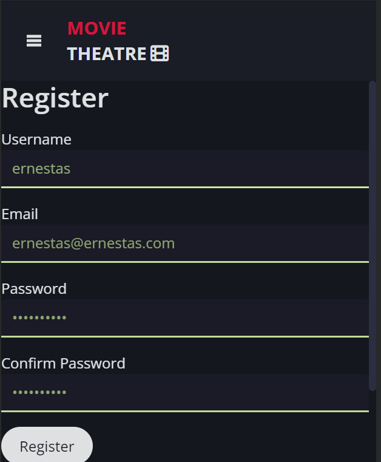
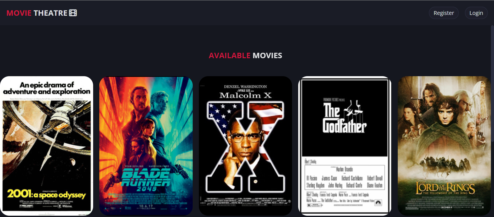
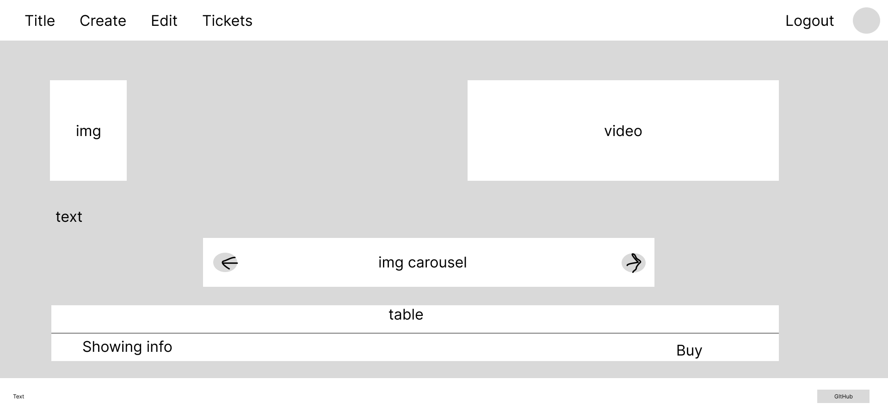
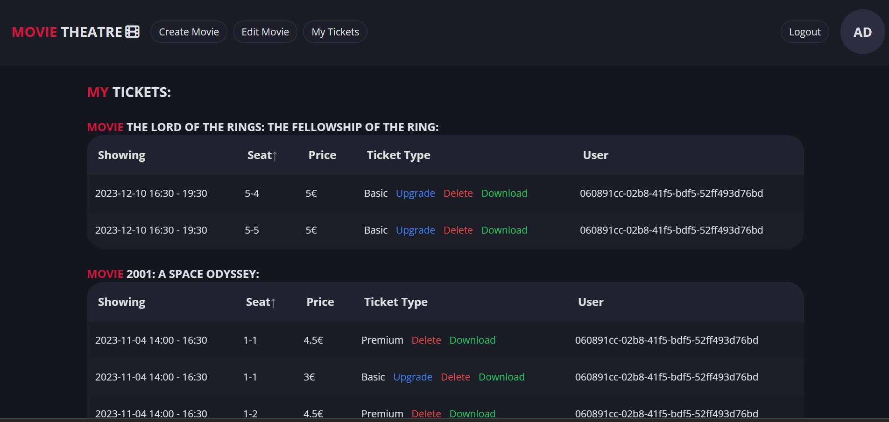
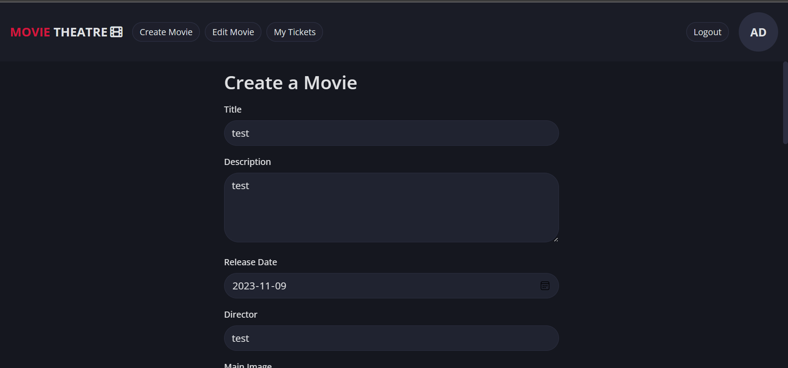
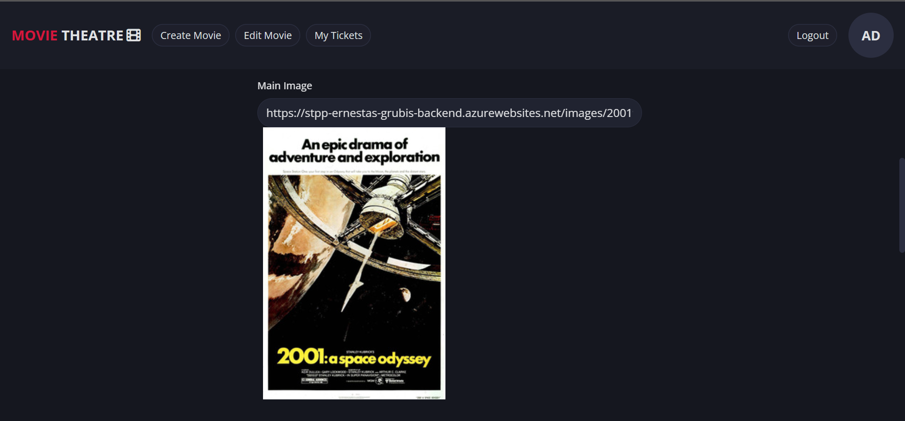
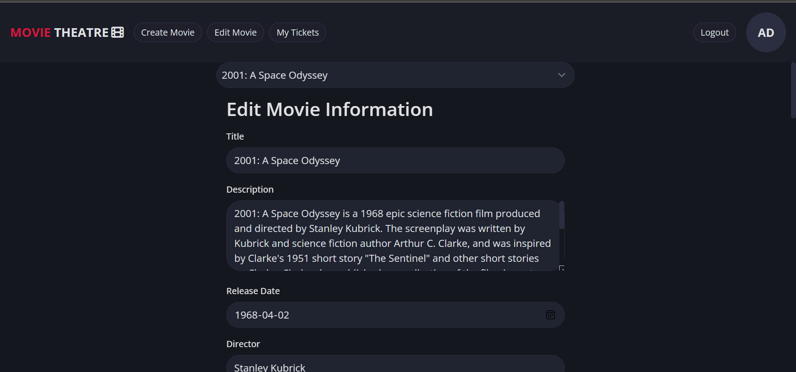
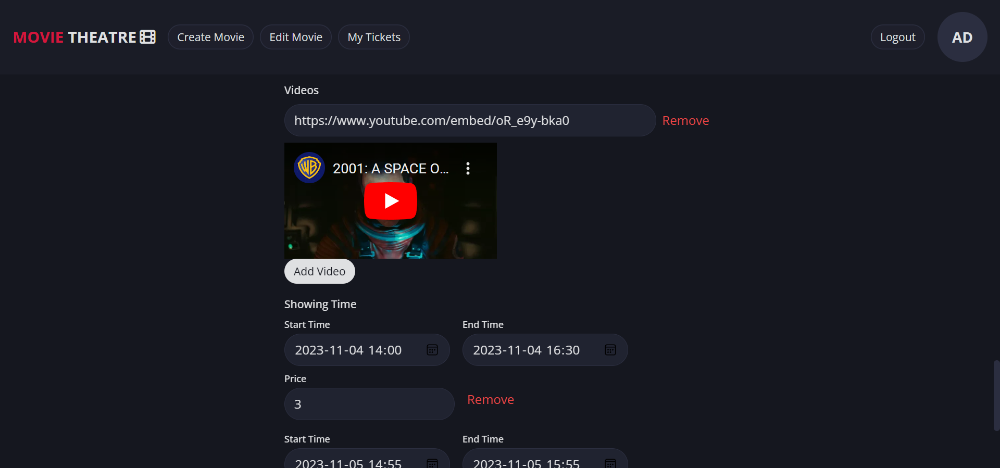

# 1. Sprendžiamo uždavinio aprašymas

## 1.1. Sistemos paskirtis

Projekto tikslas - sukurti kino teatro informacinę sistemą.

Kuriamą platformą sudaro klientinė dalis, serverinė dalis ir duomenų bazė. Klientas naudos klientinę sistemos dalį per grafinę naudotojo sąsają, kuri su serverine dalimi komunikuos per REST principu sudarytą API. Duomenys kaupiami duomenų bazėje.

Sistemoje egzistuos trys kliento rolės:

- Svečias
- Narys
- Administratorius

Sistema turi tarpusavyje susietus hierarchiniu ryšiu objektus (filmas -\> seansas -\> bilietas), kuriems bus realizuojami API metodai (CRUD + gauti objektų sąrašą), tarp jų ir hierarchiniai (pvz. API metodas gauti tam tikro filmo seansus).

Sistemoje realizuota autentifikacija ir autorizacija su JWT.

Sistema pasiekiama saityne, tam panaudojant Microsoft Azure ir Vercel debesų technologijas.

## 1.2. Funkciniai reikalavimai

**Svečias** gali:
- Peržiūrėti informaciją apie filmus ir jų seansus.
- Užsiregistruoti

**Naudotojas** gali:
- Prisijungti / atsijungti
- Peržiūrėti informaciją apie filmus ir jų seansus.
- Peržiūrėti tam tikro seanso bilietų informaciją.
- Nusipirkti bilietą
- Peržiūrėti savo bilietus, juos redaguoti (pvz: keisti bilieto tipą) ar naikinti (jei įmanoma)
- Parsisiųsti bilietą PDF formatu

**Administratorius** gali:

- Tą patį kaip ir naudotojas
- Sukurti naujus filmus sistemoje, juos redaguoti ir ištrinti
- Sukurti tam tikro filmo seansus, juos redaugoti ir ištrinti
- Valdyti nupirktus bilietus

# 2. Pasirinktų technologijų aprašymas

Klientinė dalis realizuojama su SvelteKit karkasu. Tai yra modernus ir efektyvus karkasus kurti naudotojo sąsajoms, kuris leidžia sąsają skirstyti į komponentus ir juos lengvai pernaudoti. Naudotojo sąsajai pagrąžinti naudojama Tailwind CSS biblioteka ir Skeleton UI biblioteka.

Serverinė dalis realizuojama su ASP.NET Core karkasu, kuris yra lengvai konfigūruojamas ir puikiai tinka kurti RESTful API.

Pasirinkta duomenų bazė yra PostgreSQL dėl jos Entity Framework palaikymo serverinėje dalyje ir patogumo naudotis.

Autentifikacijai / autorizacijai užtikrinti naudojama JWT technologija.

Serverinė dalis iškelta į Microsoft Azure debesį. Microsoft Azure buvo pasirinkta dėl esamos patirties dirbant su ja. Klientinė dalis iškelta į Vercel debesį, dėl patogumo tai padaryti ir nemokamo plano.

# 3. Sistemos architektūra

Žemiau pavaizduota kuriamos sistemos architektūra (pav. 1)


_pav. 1 Sistemos architektūra_

# 4. Naudotojo sąsajos projektas

## Registracija:
- Wireframe:


- Realizacijos didelio lango iškarpos:


- Realizacijos mažo lango iškarpos:



## Prisijungimas:
- Wireframe:


- Realizacijos didelio lango iškarpos:


- Realizacijos mažo lango iškarpos:


## Pagrindinis langas:
- Wireframe:


- Realizacijos didelio lango iškarpos:



- Realizacijos mažo lango iškarpos:


## Filmo langas:
- Wireframe:



- Realizacijos didelio lango iškarpos:


- Realizacijos mažo lango iškarpos:


## Filmo langas:
- Wireframe:


- Realizacijos didelio lango iškarpos:


- Realizacijos mažo lango iškarpos:


## Bilieto pirkimo modalas:
- Wireframe:


- Realizacijos didelio lango iškarpos:


- Realizacijos mažo lango iškarpos:


## Bilietų peržiūros langas:
- Wireframe:


- Realizacijos didelio lango iškarpos:



- Realizacijos mažo lango iškarpos:


## Filmo ir jo seansų kūrimo langas:
- Wireframe:


- Realizacijos didelio lango iškarpos:





- Realizacijos mažo lango iškarpos:


## Filmo ir jo seansų redagavimo langas:
- Wireframe:


- Realizacijos didelio lango iškarpos:






- Realizacijos mažo lango iškarpos:


# 5. API specifikacija

## 5.1. Movie

### POST /api/v1/movies

#### Aprašymas:

Sukuria Movie objektą

#### Resurso URL:

**https://stpp-ernestas-grubis-backend.azurewebsites.net/api/v1/movies**

#### Resurso informacija:

- Atsakymo formatas: JSON
- Reikalauja autentifikacijos: taip (administratorius)

#### Parametrai:

Nėra

#### Pavyzdinė užklausa:

```
curl --location 'https://stpp-ernestas-grubis-backend.azurewebsites.net/api/v1/movies' \
    --header 'Content-Type: application/json' \
    --header 'Authorization: Bearer {token} \
    --data '{
        "Title": "test",
        "Description": "test",
        "Director": "test",
        "ReleaseDate": "1972-03-14T12:00:00Z",
        "MainImage": "http://a.com/a.png",
        "Images": ["http://a.com/b.png", "http://a.com/c.png"],
        "Videos": ["https://youtube.com/embed/LXb3EKWsInQ"]
    }'
```

#### Pavyzdinis atsakymas:

HTTP kodas 201

```
{
    "id": 50,
    "title": "test",
    "description": "test",
    "releaseDate": "1972-03-14T12:00:00Z",
    "director": "test",
    "mainImage": "http://a.com/a.png",
    "images": [
        "http://a.com/b.png",
        "http://a.com/c.png"
    ],
    "videos": [
        "https://youtube.com/embed/LXb3EKWsInQ"
    ]
}
```

#### Kiti galimi atsakymai:

- HTTP kodas 400, jei datos formatas neatitinka UTC

### GET /api/v1/movies

#### Aprašymas:

Gauna Movie objektų sąrašą puslapiais

#### Resurso URL:

**https://stpp-ernestas-grubis-backend.azurewebsites.net/api/v1/movies**

#### Resurso informacija:

- Atsakymo formatas: JSON
- Reikalauja autentifikacijos: ne

#### Parametrai:

| Pavadinimas | Būtinas | Aprašymas | Nustatyta reikšmė | Pavyzdinė reikšmė |
| --- | --- | --- | --- | --- |
| PageNumber | Ne | Puslapis | 1 | 1 |
| PageSize | Ne | Puslapio dydis | 2 | 2 |

#### Pavyzdinė užklausa:

```
curl --location 'https://stpp-ernestas-grubis-backend.azurewebsites.net/api/v1/movies?PageNumber=1&PageSize=2'
```

#### Pavyzdinis atsakymas:

HTTP kodas 200

```
[
    {
        "id": 4,
        "title": "2001: A Space Odyssey",
        "description": "2001: A Space Odyssey is a 1968 epic science fiction film produced and directed by Stanley Kubrick. The screenplay was written by Kubrick and science fiction author Arthur C. Clarke, and was inspired by Clarke's 1951 short story \"The Sentinel\" and other short stories by Clarke. Clarke also published a novelisation of the film, in part written concurrently with the screenplay, after the film's release. The film stars Keir Dullea, Gary Lockwood, William Sylvester, and Douglas Rain and follows a voyage by astronauts, scientists, and the sentient supercomputer HAL to Jupiter to investigate an alien monolith.",
        "releaseDate": "1968-04-02T12:00:00Z",
        "director": "Stanley Kubrick",
        "mainImage": "https://stpp-ernestas-grubis-backend.azurewebsites.net/images/2001%20A%20Space%20Odyssey.jpg",
        "images": [
            "https://m.media-amazon.com/images/M/MV5BYTczMTBkZTUtODU5My00Y2Y2LTg2OTctOTFkNTg3ZWE5YTNkXkEyXkFqcGdeQXVyMTUzMTg2ODkz._V1_.jpg",
            "https://m.media-amazon.com/images/M/MV5BODlkNTc0YWEtZjg4OS00ZjFhLThkZjgtYWQwMzI4MmY5NDQzXkEyXkFqcGdeQXVyMDc2NTEzMw@@._V1_.jpg",
            "https://m.media-amazon.com/images/M/MV5BMzEzMTQ4ODQtZGJiOS00YTRhLWI4ZjQtYjVhMzIzNTdlZDU5XkEyXkFqcGdeQXVyMDc2NTEzMw@@._V1_.jpg",
            "https://m.media-amazon.com/images/M/MV5BOTlmYjhkZGYtNjNkNy00NGMzLWE2Y2YtYjIxOWMxZGQwYTU2XkEyXkFqcGdeQXVyMDc2NTEzMw@@._V1_.jpg",
            "https://m.media-amazon.com/images/M/MV5BZTlkNTk0OGYtYzQxYS00YjlkLTlkNjYtOTNlMjY3ZTkyMWEzXkEyXkFqcGdeQXVyMDc2NTEzMw@@._V1_.jpg"
        ],
        "videos": [
            "https://www.youtube.com/embed/oR_e9y-bka0"
        ]
    },
    {
        "id": 1,
        "title": "Blade Runner 2049",
        "description": "Blade Runner 2049 is a 2017 American epic neo-noir science fiction film directed by Denis Villeneuve and written by Hampton Fancher and Michael Green. A sequel to the 1982 film Blade Runner, the film stars Ryan Gosling and Harrison Ford, with Ana de Armas, Sylvia Hoeks, Robin Wright, Mackenzie Davis, Dave Bautista, and Jared Leto in supporting roles. Ford and Edward James Olmos reprise their roles from the original film. Gosling plays K, a Nexus-9 replicant blade runner who uncovers a secret that threatens to destabilize society and the course of civilization.",
        "releaseDate": "2017-10-03T12:00:00Z",
        "director": "Denis Villeneuve",
        "mainImage": "https://stpp-ernestas-grubis-backend.azurewebsites.net/images/blade%20runner%202049.jpg",
        "images": [
            "https://m.media-amazon.com/images/M/MV5BMTg3NDIwNzU3MF5BMl5BanBnXkFtZTgwMDQ5MjY2MzI@._V1_.jpg",
            "https://m.media-amazon.com/images/M/MV5BMTgyMzYyMTU2NF5BMl5BanBnXkFtZTgwMTQ5MjY2MzI@._V1_.jpg",
            "https://m.media-amazon.com/images/M/MV5BMTU5NTkwNTA2NF5BMl5BanBnXkFtZTgwMjQ5MjY2MzI@._V1_.jpg",
            "https://m.media-amazon.com/images/M/MV5BNDc5NjM5MzY5N15BMl5BanBnXkFtZTgwNTQ5MjY2MzI@._V1_.jpg",
            "https://m.media-amazon.com/images/M/MV5BMTg0OTk2Njk2OF5BMl5BanBnXkFtZTgwNjQ5MjY2MzI@._V1_.jpg",
            "https://m.media-amazon.com/images/M/MV5BMjE2OTA5MjQzNl5BMl5BanBnXkFtZTgwNzQ5MjY2MzI@._V1_.jpg"
        ],
        "videos": [
            "https://www.youtube.com/embed/gCcx85zbxz4"
        ]
    },
    {
        "id": 2,
        "title": "Malcolm X",
        "description": "Malcolm X (sometimes stylized as X) is a 1992 American epic biographical drama film about the African-American activist Malcolm X. Directed and co-written by Spike Lee, the film stars Denzel Washington in the title role, as well as Angela Bassett, Albert Hall, Al Freeman Jr., and Delroy Lindo. Lee has a supporting role, while Black Panther Party co-founder Bobby Seale, the Rev. Al Sharpton, and future South African president Nelson Mandela make a cameo appearance. It is the second of four film collaborations between Washington and Lee.\n\nMalcolm X's screenplay, co-credited to Lee and Arnold Perl, is based largely on Alex Haley's 1965 book, The Autobiography of Malcolm X. Haley collaborated with Malcolm X on the book beginning in 1963 and completed it after Malcolm X's death. The film dramatizes key events in Malcolm X's life: his criminal career, his incarceration, his conversion to Islam, his ministry as a member of the Nation of Islam and his later falling out with the organization, his marriage to Betty X, his pilgrimage to Mecca and reevaluation of his views concerning whites, and his assassination on February 21, 1965. Defining childhood incidents, including his father's death, his mother's mental illness, and his experiences with racism are dramatized in flashbacks.",
        "releaseDate": "1992-11-18T12:00:00Z",
        "director": "Spike Lee",
        "mainImage": "https://stpp-ernestas-grubis-backend.azurewebsites.net/images/malcolm%20x.jpg",
        "images": [
            "https://m.media-amazon.com/images/M/MV5BMTgyMDUzMDYxNl5BMl5BanBnXkFtZTcwMzAzNDQyNw@@._V1_.jpg",
            "https://m.media-amazon.com/images/M/MV5BMTYyNjI1MDI0OF5BMl5BanBnXkFtZTcwNDAzNDQyNw@@._V1_.jpg",
            "https://m.media-amazon.com/images/M/MV5BMTYxNjExODA5OF5BMl5BanBnXkFtZTcwNTAzNDQyNw@@._V1_.jpg",
            "https://m.media-amazon.com/images/M/MV5BMTU2MTE1NTMyOF5BMl5BanBnXkFtZTcwNjAzNDQyNw@@._V1_.jpg",
            "https://m.media-amazon.com/images/M/MV5BMTU5MTEyODQ4NF5BMl5BanBnXkFtZTcwODAzNDQyNw@@._V1_.jpg"
        ],
        "videos": [
            "https://www.youtube.com/embed/sx4sEvhYeVE"
        ]
    }
]
```

#### Kiti galimi atsakymai:

Nėra

### GET /api/v1/movies/{movieId}

#### Aprašymas:

Gauna Movie objektą pagal Id

#### Resurso URL:

**https://stpp-ernestas-grubis-backend.azurewebsites.net/api/v1/movies/{movieId}**

#### Resurso informacija:

- Atsakymo formatas: JSON
- Reikalauja autentifikacijos: ne

#### Parametrai:

| Pavadinimas | Būtinas | Aprašymas | Nustatyta reikšmė | Pavyzdinė reikšmė |
| --- | --- | --- | --- | --- |
| movieId | Taip | Movie objekto Id || 3 |

#### Pavyzdinė užklausa:

```
curl -X  'GET'  \
	'https://localhost:7252/api/v1/movies/4'  \
	-H  'accept: text/plain'
```

####

#### Pavyzdinis atsakymas:

HTTP kodas 200

```
{
    "id": 4,
    "title": "2001: A Space Odyssey",
    "description": "2001: A Space Odyssey is a 1968 epic science fiction film produced and directed by Stanley Kubrick. The screenplay was written by Kubrick and science fiction author Arthur C. Clarke, and was inspired by Clarke's 1951 short story \"The Sentinel\" and other short stories by Clarke. Clarke also published a novelisation of the film, in part written concurrently with the screenplay, after the film's release. The film stars Keir Dullea, Gary Lockwood, William Sylvester, and Douglas Rain and follows a voyage by astronauts, scientists, and the sentient supercomputer HAL to Jupiter to investigate an alien monolith.",
    "releaseDate": "1968-04-02T12:00:00Z",
    "director": "Stanley Kubrick",
    "mainImage": "https://stpp-ernestas-grubis-backend.azurewebsites.net/images/2001%20A%20Space%20Odyssey.jpg",
    "images": [
        "https://m.media-amazon.com/images/M/MV5BYTczMTBkZTUtODU5My00Y2Y2LTg2OTctOTFkNTg3ZWE5YTNkXkEyXkFqcGdeQXVyMTUzMTg2ODkz._V1_.jpg",
        "https://m.media-amazon.com/images/M/MV5BODlkNTc0YWEtZjg4OS00ZjFhLThkZjgtYWQwMzI4MmY5NDQzXkEyXkFqcGdeQXVyMDc2NTEzMw@@._V1_.jpg",
        "https://m.media-amazon.com/images/M/MV5BMzEzMTQ4ODQtZGJiOS00YTRhLWI4ZjQtYjVhMzIzNTdlZDU5XkEyXkFqcGdeQXVyMDc2NTEzMw@@._V1_.jpg",
        "https://m.media-amazon.com/images/M/MV5BOTlmYjhkZGYtNjNkNy00NGMzLWE2Y2YtYjIxOWMxZGQwYTU2XkEyXkFqcGdeQXVyMDc2NTEzMw@@._V1_.jpg",
        "https://m.media-amazon.com/images/M/MV5BZTlkNTk0OGYtYzQxYS00YjlkLTlkNjYtOTNlMjY3ZTkyMWEzXkEyXkFqcGdeQXVyMDc2NTEzMw@@._V1_.jpg"
    ],
    "videos": [
        "https://www.youtube.com/embed/oR_e9y-bka0"
    ]
}
```

#### Kiti galimi atsakymai:

- HTTP kodas 404, jei movie objektas su nurodytu movieId neegzistuoja

### PUT /api/v1/movies/{movieId}

#### Aprašymas:

Modifikuoja Movie objektą pagal Id

#### Resurso URL:

**https://stpp-ernestas-grubis-backend.azurewebsites.net/api/v1/movies/{movieId}**

#### Resurso informacija:

- Atsakymo formatas: JSON
- Reikalauja autentifikacijos: taip (administratorius)

#### Parametrai:

| Pavadinimas | Būtinas | Aprašymas | Nustatyta reikšmė | Pavyzdinė reikšmė |
| --- | --- | --- | --- | --- |
| movieId | Taip | Movie objekto Id || 9 |

#### Pavyzdinė užklausa:

```
curl --location --request PUT 'https://stpp-ernestas-grubis-backend.azurewebsites.net/api/v1/movies/50' \
    --header 'Content-Type: application/json' \
    --header 'Authorization: Bearer {token}' \
    --data '{
        "title":  "test" ,
        "description": "test",
        "releaseDate":  "1992-11-18T12:00:00Z" ,
        "director":  "test",
        "mainImage": "http://a.com/a.png",
        "images": [
            "http://a.com/b.png",
            "http://a.com/c.png"
        ],
        "videos": [
            "https://youtube.com/embed/LXb3EKWsInQ"
        ]
    }'
```

#### Pavyzdinis atsakymas:

HTTP kodas 200

```
{
    "id": 50,
    "title": "test",
    "description": "test",
    "releaseDate": "1992-11-18T12:00:00Z",
    "director": "test",
    "mainImage": "http://a.com/a.png",
    "images": [
        "http://a.com/b.png",
        "http://a.com/c.png"
    ],
    "videos": [
        "https://youtube.com/embed/LXb3EKWsInQ"
    ]
}
```

#### Kiti galimi atsakymai:

- HTTP kodas 404, jei movie objektas su nurodytu movieId neegzistuoja
- HTTP kodas 400, jei releaseDate formatas neatitinka UTC

### DELETE /api/v1/movies/{movieId}

#### Aprašymas:

Ištrina Movie objektą pagal Id

#### Resurso URL:

**https://stpp-ernestas-grubis-backend.azurewebsites.net/api/v1/movies/{movieId}**

#### Resurso informacija:

- Atsakymo formatas: JSON
- Reikalauja autentifikacijos: taip (administratorius)

#### Parametrai:

| Pavadinimas | Būtinas | Aprašymas | Nustatyta reikšmė | Pavyzdinė reikšmė |
| --- | --- | --- | --- | --- |
| movieId | Taip | Movie objekto Id | | 9 |

#### Pavyzdinė užklausa:

```
curl --location --request DELETE 'https://stpp-ernestas-grubis-backend.azurewebsites.net/api/v1/movies/50' \
    --header 'Authorization: Bearer {token}'
```

#### Pavyzdinis atsakymas:

HTTP kodas 204
```

```

#### Kiti galimi atsakymai:

- HTTP kodas 404, jei movie objektas su nurodytu movieId neegzistuoja

## 5.2 Showing

### POST /api/v1/movies/{movieId}/showings

#### Aprašymas:

Sukuria Showing objektą, kuris priklauso tam tikram Movie objektui

#### Resurso URL:

**https://stpp-ernestas-grubis-backend.azurewebsites.net/api/v1/movies/{movieId}/showings**

#### Resurso informacija:

- Atsakymo formatas: JSON
- Reikalauja autentifikacijos: taip(administratorius)

#### Parametrai:

| Pavadinimas | Būtinas | Aprašymas | Nustatyta reikšmė | Pavyzdinė reikšmė |
| --- | --- | --- | --- | --- |
| movieId | Taip | Movie objekto id | | 5 |

#### Pavyzdinė užklausa:

```
curl --location 'https://stpp-ernestas-grubis-backend.azurewebsites.net/api/v1/movies/4/showings' \
    --header 'Content-Type: application/json' \
    --header 'Authorization: Bearer {token}' \
    --data '{
      "startTime": "2023-10-19T19:01:02.290Z",
      "endTime": "2023-10-19T20:01:02.290Z",
      "price": 5
    }'
```

#### Pavyzdinis atsakymas:

HTTP kodas 201

```
{
    "number": 3,
    "startTime": "2023-10-19T19:01:02.29Z",
    "endTime": "2023-10-19T20:01:02.29Z",
    "movieId": 4,
    "price": 5
}
```

#### Kiti galimi atsakymai:

- HTTP kodas 400, jei Movie objektas su movieId kaip id neegzistuoja arba jei StartTime neatitinka UTC formato, arba jei EndTime neatitinka UTC formato arba jei EndTime \< StartTime

### GET /api/v1/movies/{movieId}/showings

#### Aprašymas:

Gauna Showing objektų sąrašą puslapiais

#### Resurso URL:

**https://stpp-ernestas-grubis-backend.azurewebsites.net/api/v1/movies/{movieId}/showings**

#### Resurso informacija:

- Atsakymo formatas: JSON
- Reikalauja autentifikacijos: ne

#### Parametrai:

| Pavadinimas | Būtinas | Aprašymas | Nustatyta reikšmė | Pavyzdinė reikšmė |
| --- | --- | --- | --- | --- |
| PageNumber | Ne | Puslapis | 1 | 1 |
| PageSize | Ne | Puslapio dydis | 2 | 2 |
| movieId | Taip | Movie objekto Id | -1 | 5 |

#### Pavyzdinė užklausa:

```
curl --location 'https://stpp-ernestas-grubis-backend.azurewebsites.net/api/v1/movies/4/showings?PageNumber=1&PageSize=50'
```

#### Pavyzdinis atsakymas:

HTTP kodas 200

```
[
    {
        "number": 3,
        "startTime": "2023-10-19T19:01:02.29Z",
        "endTime": "2023-10-19T20:01:02.29Z",
        "movieId": 4,
        "price": 5
    },
    {
        "number": 1,
        "startTime": "2023-11-04T14:00:00Z",
        "endTime": "2023-11-04T17:30:00Z",
        "movieId": 4,
        "price": 6
    },
    {
        "number": 2,
        "startTime": "2023-11-05T14:55:00Z",
        "endTime": "2023-11-05T15:55:00Z",
        "movieId": 4,
        "price": 10
    }
]
```

#### Kiti galimi atsakymai:

- Jei movieId paliktas kaip -1 grąžinami visi Showing objektai su HTTP kodu 200

### GET /api/v1/movies/{movieId}/showings/{showingId}

#### Aprašymas:

Gauna Showing objektą pagal movieId ir showingId

#### Resurso URL:

**https://stpp-ernestas-grubis-backend.azurewebsites.net/api/v1/movies/{movieId}/showings/{showingId}**

#### Resurso informacija:

- Atsakymo formatas: JSON
- Reikalauja autentifikacijos: ne

#### Parametrai:

| Pavadinimas | Būtinas | Aprašymas | Nustatyta reikšmė | Pavyzdinė reikšmė |
| --- | --- | --- | --- | --- |
| movieId | Taip | Movie objekto Id || 5 |
| showingId | Taip | Showing objekto Id || 2 |

#### Pavyzdinė užklausa:

```
curl --location 'https://stpp-ernestas-grubis-backend.azurewebsites.net/api/v1/movies/4/showings/1'
```

####

#### Pavyzdinis atsakymas:

HTTP kodas 200

```
{
    "number": 1,
    "startTime": "2023-11-04T14:00:00Z",
    "endTime": "2023-11-04T17:30:00Z",
    "movieId": 4,
    "price": 6
}
```

#### Kiti galimi atsakymai:

- HTTP kodas 404, jei movie objektas su nurodytu movieId ir showingId neegzistuoja

### PUT /api/v1/movies/{movieId}/showings/{showingId}

#### Aprašymas:

Modifikuoja Showing objektą pagal movieId ir showingId

#### Resurso URL:

**https://stpp-ernestas-grubis-backend.azurewebsites.net/api/v1/movies/{movieId}/showings/{showingId}**

#### Resurso informacija:

- Atsakymo formatas: JSON
- Reikalauja autentifikacijos: taip (administratorius)

#### Parametrai:

| Pavadinimas | Būtinas | Aprašymas | Nustatyta reikšmė | Pavyzdinė reikšmė |
| --- | --- | --- | --- | --- |
| movieId | Taip | Movie objekto Id || 5 |
| showingId | Taip | Showing objekto Id || 2 |

#### Pavyzdinė užklausa:

```
curl --location --request PUT 'https://stpp-ernestas-grubis-backend.azurewebsites.net/api/v1/movies/4/showings/1' \
    --header 'Content-Type: application/json' \
    --header 'Authorization: Bearer {token}' \
    --data '{
      "startTime": "2023-11-04T14:00:00Z",
      "endTime": "2023-11-04T16:30:00Z",
      "price": 3
    }'
```

#### Pavyzdinis atsakymas:

HTTP kodas 200

```
{
    "number": 1,
    "startTime": "2023-11-04T14:00:00Z",
    "endTime": "2023-11-04T16:30:00Z",
    "movieId": 4,
    "price": 3
}
```

#### Kiti galimi atsakymai:

- HTTP kodas 404, jei showing objektas su nurodytu movieId ir showingId neegzistuoja
- HTTP kodas 400, jei startTime formatas neatitinka UTC arba jei endTime formatas neatitinka UTC arba jei endTime \< startTime

### DELETE /api/v1/movies/{movieId}/showings/{showingId}

#### Aprašymas:

Ištrina Showing objektą pagal movieId ir showingId

#### Resurso URL:

**https://stpp-ernestas-grubis-backend.azurewebsites.net/api/v1/movies/{movieId}/showings/{showingId}**

#### Resurso informacija:

- Atsakymo formatas: JSON
- Reikalauja autentifikacijos: taip (administratorius)

#### Parametrai:

| Pavadinimas | Būtinas | Aprašymas | Nustatyta reikšmė | Pavyzdinė reikšmė |
| --- | --- | --- | --- | --- |
| movieId | Taip | Movie objekto Id || 5 |
| showingId | Taip | Showing objekto Id || 2 |

#### Pavyzdinė užklausa:

```
curl --location --request DELETE 'https://stpp-ernestas-grubis-backend.azurewebsites.net/api/v1/movies/4/showings/3' \
    --header 'Authorization: Bearer {token}'
```

#### Pavyzdinis atsakymas:

HTTP kodas 204

#### Kiti galimi atsakymai:

- HTTP kodas 404, jei Showing objektas su nurodytu movieId ir showingId neegzistuoja

## 5.3. Ticket

### POST /api/v1/movies/{movieId}/showings/{showingId}/tickets

#### Aprašymas:

Sukuria Ticket objektą, kuris priklauso tam tikram Movie objektui ir Showing objektui

#### Resurso URL:

**https://stpp-ernestas-grubis-backend.azurewebsites.net/api/v1/movies/{movieId}/showings/{showingId}/tickets**

#### Resurso informacija:

- Atsakymo formatas: JSON
- Reikalauja autentifikacijos: taip(prisijungęs naudotojas)

#### Parametrai:

| Pavadinimas | Būtinas | Aprašymas | Nustatyta reikšmė | Pavyzdinė reikšmė |
| --- | --- | --- | --- | --- |
| movieId | Taip | Movie objekto id || 5 |
| showingId | Taip | Showing objekto id || 1 |

#### Pavyzdinė užklausa:

```
curl --location 'https://stpp-ernestas-grubis-backend.azurewebsites.net/api/v1/movies/4/showings/1/tickets' \
    --header 'Content-Type: application/json' \
    --header 'Authorization: Bearer {token}' \
    --data '{
      "seat": "1-1",
      "ticketType": 0
    }'
```

#### Pavyzdinis atsakymas:

HTTP kodas 201

```
{
    "id": 26,
    "movieId": 4,
    "showingNumber": 1,
    "ticketType": 0,
    "seat": "1-1",
    "userId": "060891cc-02b8-41f5-bdf5-52ff493d76bd"
}
```

#### Kiti galimi atsakymai:

- HTTP kodas 400, jei Movie objektas su movieId kaip id neegzistuoja arba jei Showing objektas su showingId neegzistuoja

### GET /api/v1/movies/{movieId}/showings/{showingId}/tickets

#### Aprašymas:

Gauna Ticket objektų sąrašą puslapiais

#### Resurso URL:

**https://stpp-ernestas-grubis-backend.azurewebsites.net/api/v1/movies/{movieId}/showings/{showingId}/tickets**

#### Resurso informacija:

- Atsakymo formatas: JSON
- Reikalauja autentifikacijos: taip(administratorius visų bilietų peržiūrėjimui, prisijungęs vartotojas savo bilietų peržiūrėjimui)

#### Parametrai:

| Pavadinimas | Būtinas | Aprašymas | Nustatyta reikšmė | Pavyzdinė reikšmė |
| --- | --- | --- | --- | --- |
| PageNumber | Ne | Puslapis | 1 | 1 |
| PageSize | Ne | Puslapio dydis | 2 | 2 |
| movieId | Taip | Movie objekto Id | -1 | 5 |
| showingId | Taip | Showing objekto Id | -1 | 1 |

#### Pavyzdinė užklausa:

```
curl --location 'https://stpp-ernestas-grubis-backend.azurewebsites.net/api/v1/movies/4/showings/1/tickets?PageNumber=1&PageSize=50' \
--header 'Authorization: Bearer {token}' \
```

#### Pavyzdinis atsakymas:

HTTP kodas 200

```
[
    {
        "id": 1,
        "movieId": 4,
        "showingNumber": 1,
        "ticketType": 1,
        "seat": "3-4",
        "userId": "060891cc-02b8-41f5-bdf5-52ff493d76bd"
    },
    {
        "id": 2,
        "movieId": 4,
        "showingNumber": 1,
        "ticketType": 1,
        "seat": "3-5",
        "userId": "060891cc-02b8-41f5-bdf5-52ff493d76bd"
    },
    {
        "id": 3,
        "movieId": 4,
        "showingNumber": 1,
        "ticketType": 1,
        "seat": "3-6",
        "userId": "060891cc-02b8-41f5-bdf5-52ff493d76bd"
    },
    {
        "id": 4,
        "movieId": 4,
        "showingNumber": 1,
        "ticketType": 1,
        "seat": "2-10",
        "userId": "b9092e82-e6a2-4d40-9521-c67e888112bf"
    }
]
```

#### Kiti galimi atsakymai:

- Jei movieId paliktas kaip -1 grąžinami visi Ticket objektai su HTTP kodu 200, jei movieId nustatytas, o showingId ne, grąžinami visi tam tikro Showing Ticket objektai su kodu 200

### GET /api/v1/movies/{movieId}/showings/{showingId}/tickets/{ticketId}

#### Aprašymas:

Gauna Ticket objektą pagal movieId, showingId ir ticketId

#### Resurso URL:

**https://stpp-ernestas-grubis-backend.azurewebsites.net/api/v1/movies/{movieId}/showings/{showingId}/tickets/{ticketId}**

#### Resurso informacija:

- Atsakymo formatas: JSON
- Reikalauja autentifikacijos: taip(administratorius visų bilietų peržiūrėjimui, prisijungęs vartotojas savo bilietų peržiūrėjimui)

#### Parametrai:

| Pavadinimas | Būtinas | Aprašymas | Nustatyta reikšmė | Pavyzdinė reikšmė |
| --- | --- | --- | --- | --- |
| movieId | Taip | Movie objekto Id || 5 |
| showingId | Taip | Showing objekto Id || 1 |
| ticketId | Taip | Ticket objekto Id || 1 |

#### Pavyzdinė užklausa:

```
curl --location 'https://stpp-ernestas-grubis-backend.azurewebsites.net/api/v1/movies/4/showings/1/tickets/1' \
    --header 'Authorization: Bearer {token}'
```

####

#### Pavyzdinis atsakymas:

HTTP kodas 200

```
{
    "id": 1,
    "movieId": 4,
    "showingNumber": 1,
    "ticketType": 1,
    "seat": "3-4",
    "userId": "060891cc-02b8-41f5-bdf5-52ff493d76bd"
}
```

#### Kiti galimi atsakymai:

- HTTP kodas 404, jei movie objektas su nurodytu movieId ir showingId ir ticketId neegzistuoja

### PUT /api/v1/movies/{movieId}/showings/{showingId}/tickets/{ticketId}

#### Aprašymas:

Modifikuoja Ticket objektą pagal movieId ir showingId ir ticketId

#### Resurso URL:

**https://stpp-ernestas-grubis-backend.azurewebsites.net/api/v1/movies/{movieId}/showings/{showingId}/tickets/{ticketId}**

#### Resurso informacija:

- Atsakymo formatas: JSON
- Reikalauja autentifikacijos: taip(administratorius visų bilietų modifikavimui, prisijungęs vartotojas savo bilietų modifikavimui)

#### Parametrai:

| Pavadinimas | Būtinas | Aprašymas | Nustatyta reikšmė | Pavyzdinė reikšmė |
| --- | --- | --- | --- | --- |
| movieId | Taip | Movie objekto Id || 5 |
| showingId | Taip | Showing objekto Id || 1 |
| ticketId | Taip | Ticket objekto Id || 1 |

#### Pavyzdinė užklausa:

```
curl --location --request PUT 'https://stpp-ernestas-grubis-backend.azurewebsites.net/api/v1/movies/4/showings/1/tickets/1' \
--header 'Content-Type: application/json' \
--header 'Authorization: Bearer {token}' \
--data '{
  "ticketType": 0,
  "seat": "3-4"
}'
```

#### Pavyzdinis atsakymas:

HTTP kodas 200

```
{
    "id": 1,
    "movieId": 4,
    "showingNumber": 1,
    "ticketType": 0,
    "seat": "3-4",
    "userId": "060891cc-02b8-41f5-bdf5-52ff493d76bd"
}
```

#### Kiti galimi atsakymai:

- HTTP kodas 404, jei Ticket objektas su nurodytu movieId ir showingId ir ticketId neegzistuoja

### DELETE /api/v1/movies/{movieId}/showings/{showingId}/tickets/{ticketId}

#### Aprašymas:

Ištrina Ticket objektą pagal movieId, showingId ir ticketId

#### Resurso URL:

**https://stpp-ernestas-grubis-backend.azurewebsites.net/api/v1/movies/{movieId}/showings/{showingId}/tickets/{ticketId}**

#### Resurso informacija:

- Atsakymo formatas: JSON
- Reikalauja autentifikacijos: taip (prisijungęs vartotojas)

#### Parametrai:

| Pavadinimas | Būtinas | Aprašymas | Nustatyta reikšmė | Pavyzdinė reikšmė |
| --- | --- | --- | --- | --- |
| movieId | Taip | Movie objekto Id || 5 |
| showingId | Taip | Showing objekto Id || 1 |
| ticketId | Taip | Ticket objekto Id || 4 |

#### Pavyzdinė užklausa:

```
curl --location --request DELETE 'https://stpp-ernestas-grubis-backend.azurewebsites.net/api/v1/movies/4/showings/1/tickets/26' \
    --header 'Authorization: Bearer {token}'
```

#### Pavyzdinis atsakymas:

HTTP kodas 204

#### Kiti galimi atsakymai:

- HTTP kodas 404, jei Ticket objektas su nurodytu movieId ir showingId ir ticketId neegzistuoja
- HTTP kodas 400, jei Showing objekto startTime \< dabartinis laikas

## 5.4. User

### POST /api/v1/register

#### Aprašymas:

Prisiregistruoja prie sistemos

#### Resurso URL:

**https://stpp-ernestas-grubis-backend.azurewebsites.net/api/v1/register**

#### Resurso informacija:

- Atsakymo formatas: JSON
- Reikalauja autentifikacijos: ne

#### Parametrai:

Nėra

#### Pavyzdinė užklausa:

```
curl --location 'https://stpp-ernestas-grubis-backend.azurewebsites.net/api/v1/register' \
    --header 'Content-Type: application/json' \
    --data-raw '{
      "username": "newuser5",
      "email": "newuser3@gmail.com",
      "password": "NewuserPassword#1"
    }'
```

#### Pavyzdinis atsakymas:

HTTP kodas 201

```
{
    "id": "77215657-480a-4d6c-8221-7773f516d219",
    "username": "newuser5",
    "email": "newuser3@gmail.com"
}
```

#### Kiti galimi atsakymai:

- HTTP kodas 400, jei jau yra toks vartotojas arba blogi duomenys

### POST /api/v1/login

#### Aprašymas:

Prisijungia prie sistemos

#### Resurso URL:

**https://stpp-ernestas-grubis-backend.azurewebsites.net/api/v1/users**

#### Resurso informacija:

- Atsakymo formatas: JSON
- Reikalauja autentifikacijos: ne

#### Parametrai:

Nėra

#### Pavyzdinė užklausa:

```
curl --location 'https://stpp-ernestas-grubis-backend.azurewebsites.net/api/v1/login' \
    --header 'Content-Type: application/json' \
    --data '{
      "username": "{username}",
      "password": "{password}"
    }'
```

#### Pavyzdinis atsakymas:

HTTP kodas 200

```
{
    "accessToken": "{token}"
}
```

#### Kiti galimi atsakymai:

- HTTP kodas 400, jei blogas prisijungimas

# 6. Išvados

- Sėkmingai sukurtas programinis produktas;
- Išmokta realizuoti autentifikaciją / autorizaciją su JWT
- Išmokta sukurti modernią grafinę sąsają su SvelteKit, TailwindCSS ir Skeleton UI
- Sukurtas produktas sėkmingai iškeltas į debesį ir pasiekiamas internetu